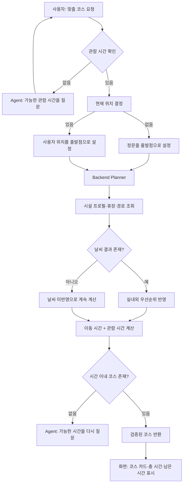

# P1-B 맞춤 코스 유저 플로우

## 1. 사용자 목표

사용자는 아이 동반 여부, 관람 가능 시간, 현재 위치를 바탕으로 제한 시간 안에 방문할 수 있는 동물원 코스를 추천받는다.

기본 예시는 다음과 같다.

> 5살 아이와 2시간 동안 볼 수 있는 코스를 추천해 줘.

## 2. 입력과 기본값

| 입력 | 필수 여부 | 기본값·규칙 |
| --- | --- | --- |
| 관람 가능 시간 | 필수 | 없으면 Agent가 추가 질문 |
| 아이 동반 여부 | 선택 | 언급이 없으면 일반 관람객 기준 |
| 현재 위치 | 선택 | 없으면 정문 |
| 날씨 | 선택 | 날씨 MCP 결과가 있을 때만 반영 |

## 3. 사용자 흐름

## 4. Backend Planner 규칙

1. 정문은 출발점이며 추천 방문 시설에는 넣지 않는다.
2. 휴장 시설은 후보에서 제외한다.
3. 총 시간은 모든 구간의 이동 시간과 각 시설의 기본 관람 시간을 합산한다.
4. 같은 시설은 중복 방문·중복 합산하지 않는다.
5. 아이 동반이면 `child_friendly=true` 시설을 우선한다.
6. 동률이면 방문 시설 수가 많은 코스, 그다음 총 시간이 짧은 코스를 선택한다.
7. 비 또는 악천후의 날씨 결과가 있으면 `indoor=true` 시설을 우선한다.
8. 날씨 Tool이 없거나 실패해도 추천은 중단하지 않고 `weather_applied=false`를 표시한다.
9. 총 시간이 사용자가 제시한 시간보다 길면 코스로 반환하지 않는다.

## 5. 예시: 5살 아이·120분

| 순서 | 시설 | 이동 | 관람 | 누적 시간 |
| ---: | --- | ---: | ---: | ---: |
| 출발 | 정문 | - | - | 0분 |
| 1 | 해양관 | 15분 | 25분 | 40분 |
| 2 | 기린관 | 19분 | 20분 | 79분 |
| 3 | 코끼리관 | 16분 | 20분 | 115분 |

남은 시간은 5분이다. 코끼리관이 휴장이면 해당 시설을 제외하고 새 코스를 계산한다.

## 6. 화면 표시 기준

- 방문 순서, 구간별 이동 시간, 시설별 관람 시간, 총 시간, 남은 시간을 표시한다.
- 날씨를 반영하지 못한 경우 “날씨 정보는 현재 코스에 반영되지 않았습니다.”를 표시한다.
- 코스가 없으면 실패처럼 보이지 않게, “현재 조건에서 가능한 코스를 만들기 어렵습니다. 관람 시간을 늘리거나 조건을 조정해 주세요.”를 표시한다.
- 코스 결과는 Agent의 임의 문장이 아니라 Backend가 계산·검증한 구조화된 결과로 표시한다.

## 7. 역할별 완료 기준

| 담당 | 완료 기준 |
| --- | --- |
| 최두나 | `course_profiles.json`과 데이터 로더·참조 무결성 테스트 제공 |
| 손영민 | Planner가 시간 제한·휴장·아이·날씨 조건을 검증하고 N-05 테스트 통과 |
| 이원민 | 코스 카드와 날씨 미반영 안내를 화면에 표시 |
