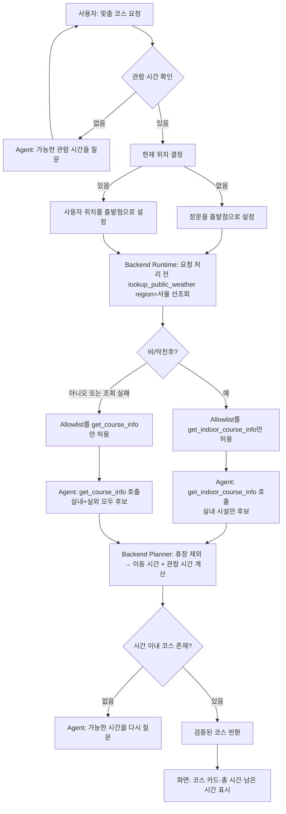

# P1-B 맞춤 코스 추천 개발 계획서 v1.8

## 0. 이 문서가 필요한 이유

기존 `get_course_info(name)`은 등록된 코스를 이름으로 "조회"만 할 뿐, `available_minutes`
같은 사용자 조건을 입력받아 "검증된 코스를 계산"하지 않는다. 그 결과 Agent가 "30분 안에
가능합니다"라고 답해도 Backend는 그 30분 조건을 Tool 입력으로 검증할 방법이 없다
(`코스추천.txt`, 1차 팀 회의 메모 — 저장소 밖 파일이라 링크하지 않는다).

현재 `choiduna` 브랜치 작업 트리에는 이미 `get_course_info`와 `data/operations/courses.json`이
제거된 상태다(커밋 전, unstaged). 이는 이 기능을 폐기하는 것이 아니라, 아래 §2에서 확정하는
새 계약으로 교체하기 위한 선행 정리로 간주하고 이 계획서를 진행한다.

이 문서는 v0.4 계획서의 N-05(`5살 아이와 2시간 코스 추천`) 시나리오를 실제로 테스트 가능한
계약으로 구체화하는 P1-B 서브플랜이다.

## 1. 목표

사용자는 **아이 동반 여부·관람 가능 시간·현재 위치**를 바탕으로, **제한 시간 안에 방문 가능한
동물원 코스**를 추천받는다.

> 대표 요청: "5살 아이와 2시간 동안 볼 수 있는 코스를 추천해 줘."

## 2. 결정 사항: Tool 계약

### 2.1 쟁점 (v1.0 초안 당시)

`코스추천.txt`가 제기한 질문: `get_course_info`를 확장해 `available_minutes`,
`child_accompanying`, `current`을 받는 Tool로 바꿀지, 아니면 기존 조회 Tool은 남기고
별도 신규 Tool을 추가할지.

v1.0 초안에서는 신규 Tool 분리안을 임시 채택했으나, **2026-09-08 팀 회의에서 아래와
같이 최종 결정했다.**

### 2.2 최종 결정 (2026-09-08 팀 회의): **`get_course_info` 확장 + 날씨(실내/실외) Tool 신규 추가**

1. 별도 Tool을 새로 만들지 않고, **기존 `get_course_info`를 확장**해서 `available_minutes`,
   `child_accompanying`, `current`을 받아 검증된 코스를 계산·반환하는 Tool로 바꾼다.
   기존 `name` 기반 단순 조회 모드는 이번 확장으로 대체되며 별도로 유지하지 않는다
   (작업 트리에서 이미 옛 `get_course_info(name)` 구현이 제거된 상태와 일치).
2. 날씨 조건(실내/실외 우선순위, 유저플로우 §4 규칙 7·8)을 판단하기 위한 **날씨 Tool을
   이번 범위에 신규로 추가**한다. `backend/app/schemas/tools.py`에 이미 자리를 잡아둔
   `PublicWeatherInput(region)` 계약을 그대로 사용해 `lookup_public_weather(region)`을
   구현한다. (2차 회의로 갱신: 이 Tool의 결과를 `get_course_info` 내부에서 소비하지
   않고, 대신 실내 전용 Tool을 별도로 분리했다 — 상세는 §5.0·§5.2 참조.)

| 검토 항목 | 신규 Tool 분리안 (v1.0, 폐기) | **확장안 (v1.1~v1.2, 채택)** |
| --- | --- | --- |
| 기존 사용처 영향 | 영향 없음 | `get_course_info(name)` 시그니처가 바뀜 — 단, 옛 구현이 이미 제거된 상태라 실질적 충돌 없음 |
| 계약 성격 | 조회(추후 필요 시)와 계산을 분리 | "코스 조회"라는 하나의 사용자 의도를 Tool 하나로 유지 |
| Agent 관점 | Allowed Tool 목록에 항목이 하나 더 늘어남 | 기존 Tool 이름을 그대로 재사용해 Agent Instructions 변경 최소화 |
| 팀 결정 | (초안 단계 제안) | **팀 회의로 확정** — 이 문서는 이 결정을 따른다 |

## 3. 사용자 흐름 요약

(`P1-B_맞춤코스_유저플로우.md` 원문 기준, 출처: 이원민 — 저장소 밖 파일이라 링크하지 않는다)



### 입력과 기본값

| 입력 | 필수 여부 | 기본값·규칙 |
| --- | --- | --- |
| 관람 가능 시간(`available_minutes`) | 필수 | 없으면 Agent가 추가 질문 |
| 아이 동반 여부(`child_accompanying`) | 선택 | 언급 없으면 일반 관람객 기준 |
| 현재 위치(`current`) | 선택 | 없으면 정문(`"정문"`) |
| 날씨 | 선택 | Backend Runtime이 요청 처리 전 `lookup_public_weather`로 먼저 확인해 Allowlist를 좁힘(§6.2), 조회 실패해도 추천은 중단하지 않음 |

## 4. 데이터 모델: `course_profiles.json` (최두나 담당)

기존 `courses.json`(고정 코스 4종을 나열하는 방식)은 "시간 제한 안에서 후보를
동적으로 조합"하는 계산에는 맞지 않는다. 대신 **시설 단위 프로필**로 데이터를
재설계한다 — Planner는 이 프로필과 함께 이미 구현된 `check_closure_status()`,
`find_habitat_route()`(v0.4 §2.1이 "조회 Tool: 먹이시간·휴장·경로, 3종"으로 지정한
P0 필수 Tool 중 2개, 함수 정의 자체는 §7.1)를 그대로 재사용해 조합을 계산한다.
새 조회 로직을 중복 구현하지 않는다.

### 4.1 파일: `data/operations/course_profiles.json`

```json
{
  "profiles": [
    {
      "habitat": "해양관",
      "visit_minutes": 25,
      "child_friendly": true,
      "indoor": true
    },
    {
      "habitat": "기린관",
      "visit_minutes": 20,
      "child_friendly": true,
      "indoor": false
    },
    {
      "habitat": "코끼리관",
      "visit_minutes": 20,
      "child_friendly": true,
      "indoor": false
    },
    {
      "habitat": "호랑이관",
      "visit_minutes": 15,
      "child_friendly": false,
      "indoor": false
    }
  ]
}
```

- `habitat`은 `habitats.json`의 정규 시설명과 **반드시 일치**해야 한다 (`"정문"`은
  출발점 전용이므로 `course_profiles.json`에는 포함하지 않는다 — 규칙 1과 일관).
- `visit_minutes`: 해당 시설의 기본 관람 시간(분). 이동 시간은 여기 포함하지 않고
  `routes.json`의 `estimated_minutes`로 별도 계산한다.
- `child_friendly`: 아이 동반 시 우선순위에 사용(규칙 5).
- `indoor`: `get_indoor_course_info`(§5.2.2)와 `get_outdoor_course_info`(§5.2.3)가
  후보 시설을 걸러내는 기준으로 사용(규칙 7).

### 4.2 로더: `backend/app/tools/zoo_tools.py`에 추가

기존 `_load_json`, `normalize_habitat` 패턴을 그대로 재사용한다.

```python
@lru_cache
def _course_profile_map() -> dict[str, dict[str, Any]]:
    """정규 시설명 -> {visit_minutes, child_friendly, indoor}."""
    payload = _load_json("operations/course_profiles.json")
    return {row["habitat"]: row for row in payload["profiles"]}


def get_course_profile(habitat: str) -> dict[str, Any] | None:
    """정규화된 시설명으로 코스 프로필 한 건을 조회한다. 없으면 None."""
    canonical = normalize_habitat(habitat)
    if canonical is None:
        return None
    return _course_profile_map().get(canonical)
```

### 4.3 참조 무결성 테스트 (최두나 완료 기준)

`tests/data/test_course_profiles.py` 신규 작성:

```python
import json
from pathlib import Path

from backend.app.core.config import DATA_DIR


def _load(relative_path: str) -> dict:
    with (DATA_DIR / relative_path).open(encoding="utf-8") as f:
        return json.load(f)


def test_course_profile_habitats_are_registered_habitats():
    """course_profiles.json의 모든 habitat이 habitats.json에 등록되어 있어야 한다."""
    profiles = _load("operations/course_profiles.json")["profiles"]
    habitats = {h["name"] for h in _load("operations/habitats.json")["habitats"]}

    for row in profiles:
        assert row["habitat"] in habitats, f"등록되지 않은 시설: {row['habitat']}"


def test_course_profile_excludes_entrance():
    """정문은 출발점 전용이므로 코스 프로필에 포함하지 않는다."""
    profiles = _load("operations/course_profiles.json")["profiles"]
    assert all(row["habitat"] != "정문" for row in profiles)


def test_course_profile_visit_minutes_are_positive():
    profiles = _load("operations/course_profiles.json")["profiles"]
    assert all(row["visit_minutes"] > 0 for row in profiles)


def test_course_profile_has_no_duplicate_habitat():
    profiles = _load("operations/course_profiles.json")["profiles"]
    names = [row["habitat"] for row in profiles]
    assert len(names) == len(set(names))
```

## 5. Tool 계약 초안

### 5.0 "관람 동선 추천" Tool 3분할 (v1.4로 정정)

1차 회의(v1.1)에서는 날씨를 **`get_course_info` 내부에서** `lookup_public_weather`를
호출해 `indoor_recommended` 플래그로 우선순위만 조정하는 단일 Tool 설계였다.

**2차 회의에서 "관람 동선 추천" Tool 자체를 3개로 나누기로 했다** — 이것이 v1.2가
"담당 3분할"로 잘못 옮겼던 결정이다(§2.3 정정 참고). 실제로는 후보 시설 범위가 다른
Tool 3종이다:

| Tool | 후보 시설 범위 | 언제 쓰나 |
| --- | --- | --- |
| `get_course_info` | 전체(실내+실외) | 기존 확장, 날씨가 좋을 때(§6.2) 기본값 |
| `get_indoor_course_info` | `indoor=true`만 | 신규, 비/악천후일 때(§6.2) |
| `get_outdoor_course_info` | `indoor=false`만 | 신규, 사용자가 실외 코스를 명시적으로 원할 때(§5.2.3) |

이 셋은 §5.2·§6에서 **같은 내부 헬퍼 `_recommend_course()`를 공유**하고 후보 필터만
다르게 받는다(DRY).

별도로, 날씨 조건 자체를 알아내는 것은 `lookup_public_weather` Tool의 역할이다(§5.2.1).
"2차 회의 — 날씨 Tool 2분할" 결정은 이 3종 중 **`get_course_info`와
`get_indoor_course_info` 두 개만** 날씨에 따라 자동으로 토글한다는 뜻이다
(`get_outdoor_course_info`는 날씨와 무관하게 사용자가 명시적으로 실외를 원할 때
쓰는 세 번째 Tool).

`get_outdoor_course_info`를 **언제** 호출할지는 5차 회의로 확정됐다: **Agent
Instructions로 유도한다** — 손영민이 `backend/app/agents/zoo_guide_agent.py`의
Instructions에 "사용자가 실외 관람만 명시적으로 요청하면(예: '야외 동물만 보고
싶어', '실외 코스로 추천해 줘') `get_outdoor_course_info`를 호출하라"는 문구를
추가한다. 이 Tool은 §6.2의 날씨 기반 narrowing 대상이 아니므로 **항상** Allowlist에
남아 있고, Backend가 강제로 선택을 좁혀주지 않는다 — §6.2(날씨 선택)와 달리 순수히
Instructions 준수에 의존하는 판단이라는 점에 유의한다(v1.2에서 날씨 선택을 이
방식으로 했다가 신뢰성 문제로 §6.2 Runtime 방식으로 바꾼 전례가 있다).

**어떤 코스 Tool을 호출할지 고르는 판단은 3차 회의에서 다시 한번 바뀌었다**: 처음엔
"Agent가 스스로 판단"(v1.2)이었으나, 이를 신뢰할 수 없다는 지적에 따라 **Backend
Runtime이 요청 처리 전에 직접 날씨를 선조회하고, 그 결과로 해당 요청의
Tool Allowlist 자체를 좁혀버리는 방식**으로 확정했다(Backend Planner 내부 분기도,
Agent 판단도 아니라 **Runtime의 Allowlist 통제** 문제로 정리). 이 로직은 손영민이
Runtime 코드로 구현한다(§6.2). 단, 이 narrowing은 `get_course_info`↔
`get_indoor_course_info` 사이에서만 일어나고 `get_outdoor_course_info`는 건드리지
않는다(위 표, §6.2에서 다시 명시).

### 5.1 `get_course_info` 확장 — Tool 1/3, 실내+실외 겸용 (최두나: 함수 본체 / 손영민: Schema·Allowlist·Runtime 검증)

기존 `CourseInfoInput`(`name: str | None`) 자리를 아래 입력 계약으로 교체한다.
`backend/app/schemas/tools.py` 패턴(`ConfigDict(extra="forbid", str_strip_whitespace=True)`)을
그대로 따른다.

```python
class CourseInfoInput(BaseModel):
    """맞춤 코스 추천 Tool(get_course_info 확장판)의 엄격한 입력 형식이다.

    get_indoor_course_info(§5.2.2)와 입력 계약을 동일하게 공유한다.
    v1.0의 name 기반 단순 조회 모드는 이 확장으로 대체된다.
    """

    model_config = ConfigDict(extra="forbid", str_strip_whitespace=True)

    available_minutes: StrictInt = Field(ge=1, le=600)
    child_accompanying: bool = False
    current: StrictStr = Field(default="정문", min_length=1, max_length=100)
```

- 함수 시그니처: `get_course_info(available_minutes: int, child_accompanying: bool = False, current: str = "정문", *, now: datetime | None = None) -> ToolRunResult`
- 후보 시설: `course_profiles.json`의 **전체** 시설(실내 + 실외).
- 기존 `zoo_tools.py`의 다른 함수(`find_habitat_route` 등)와 동일하게, `current`는
  `normalize_habitat()`으로 정규화한 뒤 사용한다. 정규화에 실패하면 `HABITAT_NOT_FOUND`.

### 5.2 실내/실외 전용 코스 Tool 2종 + 날씨 조회 Tool

#### 5.2.1 `lookup_public_weather` (최두나 구현, 손영민 Schema 검증) — 날씨 조회 전용, 코스와 무관

`backend/app/schemas/tools.py`에 이미 정의돼 있는 `PublicWeatherInput(region: str)`을
그대로 재사용한다. 이 Tool은 **코스를 계산하지 않고** 순수하게 날씨만 조회한다.

```python
class PublicWeatherData(BaseModel):
    """날씨 조회 Tool이 성공했을 때 반환하는 데이터다."""

    model_config = ConfigDict(extra="forbid", str_strip_whitespace=True)

    region: str = Field(min_length=1)
    condition: Literal["clear", "cloudy", "rain", "storm"]
    indoor_recommended: bool
    as_of: datetime
```

- `indoor_recommended`는 `condition in {"rain", "storm"}`일 때 `true` — **4차 회의로
  확정**, 즉 비(`rain`) 또는 악천후(`storm`)면 실내를 권장한다.
- 이 Tool은 `region="서울"` 고정값으로만 호출한다(3차 회의 결정, §6.2). **4차 회의로
  근거가 추가됐다**: 동물원이 서울에 위치하므로 어차피 날씨는 서울 지역만 조회하면
  된다 — 시설별로 다른 지역 날씨를 조회할 필요가 없다는 뜻이다. `current`(시설명)를
  `region`에 넘기지 않는다. Backend Runtime이 이 값 하나만 보고 §5.2.2/§5.1 중 어느
  Tool만 Allowlist에 남길지 정한다(§6.2).
- **날씨 데이터 출처: 5차 회의로 Open-Meteo API 확정** — Mock 고정값이 아니다.
  v0.4 §18의 "실제 운영 API 없음 → 동일 계약의 Mock Tool 사용" 원칙의 예외로, 이
  Tool만 처음부터 실제 외부 API를 호출한다.
  - **API**: [Open-Meteo](https://open-meteo.com) Forecast API.
  - **인증**: Open-Meteo의 비상업용 Forecast API(`api.open-meteo.com/v1/forecast`)는
    **API 키 없이 호출 가능**하다 — 무료 티어에 키가 필요 없다는 것이 Open-Meteo
    자체 공개 정책이므로, "인증 키가 실제로 필요한가"는 더 이상 열린 질문이 아니다.
    그럼에도 5차 회의에서 `.env` 등록을 확정했으므로, `backend/app/core/config.py`의
    `Settings`에 환경변수 필드(예: `OPEN_METEO_API_KEY: str = ""`, 기존
    `OPENAI_API_KEY`와 같은 패턴)를 만들어 두되 **선택값**으로 취급한다 — 값이
    비어 있으면 비상업용 무료 엔드포인트를 그대로 호출하고, 나중에 유료/커머셜
    티어(더 높은 rate limit 등)로 옮길 때만 이 키를 사용한다. 하드코딩 금지 원칙은
    v0.4 §3.1과 동일하게 유지한다.
  - **요청 파라미터**: 위경도(`latitude`, `longitude`)만 쓴다 — Open-Meteo는 격자좌표
    파라미터를 쓰지 않는다(기상청 API의 `nx`/`ny` 격자좌표계와는 다른 방식이다).
    서울 좌표(대략 `latitude=37.57`, `longitude=126.98`)를 `region="서울"`(§6.2)에
    대응하는 고정값으로 설정에 둔다.
  - **`condition` 매핑**: Open-Meteo 응답의 상세 날씨 코드(WMO Weather 코드,
    0~99)를 그대로 노출하지 않고, 이 Tool의 `condition` enum 4종으로 매핑해서
    반환한다(5차 회의: "판단하여 4개의 유효값으로 분류" — 이 판단을 아래 표로
    내렸다. 팀이 다른 분류를 원하면 이 표를 수정하면 된다):

    | WMO weather code | `condition` |
    | --- | --- |
    | 0(맑음) | `"clear"` |
    | 1, 2, 3(대체로 맑음~흐림), 45, 48(안개) | `"cloudy"` |
    | 51~67(이슬비·어는비), 71~77, 85, 86(눈), 80~82(소나기) | `"rain"` |
    | 95, 96, 99(뇌우) | `"storm"` |
- **캐싱: 4차 회의로 TTL 10분 확정**. `region="서울"` 결과를 10분 동안 캐시해
  재사용하고, 캐시 무효화는 TTL 만료만으로 처리한다(수동 갱신 기능은 만들지 않는다,
  회의에서 "부"로 확정). narrowing이 `zoo_guide`의 **모든** 요청에 적용되므로(규칙
  8·§6.2) 캐싱이 없으면 매 요청마다 실제 외부 API를 호출하게 된다 — 이제
  실제 API라서 캐싱이 선택이 아니라 필수다.
  **구현 위치는 `lookup_public_weather()` 함수 내부다**(최두나, §9 순서 5) —
  Runtime(§6.2)이나 다른 호출자가 별도로 캐시를 관리하지 않고, 이 Tool 자체가 항상
  캐시를 투명하게 적용한 뒤 결과를 돌려준다. 이렇게 하면 Runtime의 날씨 선조회든,
  Agent가 사용자 질문에 답하려고 이 Tool을 직접 호출하는 경우든 같은 캐시를 공유하고,
  캐싱 책임이 손영민(Runtime)과 최두나(Tool) 사이에서 중복되지 않는다. 캐시 저장소는
  이 프로젝트가 이미 쓰고 있는 Redis(`backend/app/core/redis_client.py`)를 재사용하는
  것을 권장하되, 최종 선택은 최두나가 구현 시 정한다.
- 이 Tool이 실패하거나 호출되지 않으면(§6.2), Backend Runtime은 Allowlist를 좁히지
  않고 더 넓은 옵션인 `get_course_info`(실내+실외 겸용)를 기본으로 유지한다 — 날씨를
  모른다고 실내로 좁혀서 실외 코스를 놓치게 하지 않는다.
- **`source` 값: 5차 회의로 확정**. 다른 조회 Tool들과 달리 이 Tool은 Mock이
  아니라 실제 외부 데이터를 반환하므로, `ToolRunResult.source`(현재 모든 Tool이
  공유하는 `SOURCE_NAME = "mock_zoo_operations"` 상수, §4.2 참고)를 그대로 쓰지
  않는다. 대신 `lookup_public_weather`만 별도의 상수
  `OPEN_METEO_SOURCE = "open_meteo_forecast"`를 `zoo_tools.py`에 정의해서 쓴다.

#### 5.2.2 `get_indoor_course_info` (신규, Tool 2/3, 최두나 구현, 손영민 Schema·Allowlist·Runtime 검증) — 실내 전용 코스 추천

#### 5.2.3 `get_outdoor_course_info` (신규, Tool 3/3, 최두나 구현, 손영민 Schema·Allowlist·Runtime 검증) — 실외 전용 코스 추천

두 Tool 모두 입력 계약은 `CourseInfoInput`(§5.1)과 **완전히 동일**하다(같은 Pydantic
모델을 그대로 재사용하며, 별도 Input 클래스를 만들지 않는다).

세 Tool(§5.1 포함)이 공유하는 내부 헬퍼의 시그니처를 먼저 고정한다(공개 Tool이
아니므로 `CourseInfoInput`을 거치지 않고 원시 인자를 받는다):

```python
FacilityScope = Literal["all", "indoor_only", "outdoor_only"]


def _recommend_course(
    available_minutes: int,
    child_accompanying: bool,
    current: str,
    *,
    facility_scope: FacilityScope,
    now: datetime | None = None,
) -> ToolRunResult:
    """course_profiles.json 후보를 §6 규칙대로 조합해 코스를 계산한다.

    facility_scope="all"          → 전체 시설
    facility_scope="indoor_only"  → course_profiles.json의 indoor=true만
    facility_scope="outdoor_only" → course_profiles.json의 indoor=false만
    그 외 로직(휴장 제외, 시간 계산, 우선순위)은 세 경우 모두 동일하다.
    """
    ...  # §6 규칙 구현


def get_course_info(
    available_minutes: int,
    child_accompanying: bool = False,
    current: str = "정문",
    *,
    now: datetime | None = None,
) -> ToolRunResult:
    """실내+실외 모두를 후보로 코스를 추천한다."""
    return _recommend_course(
        available_minutes, child_accompanying, current,
        facility_scope="all", now=now,
    )


def get_indoor_course_info(
    available_minutes: int,
    child_accompanying: bool = False,
    current: str = "정문",
    *,
    now: datetime | None = None,
) -> ToolRunResult:
    """course_profiles.json에서 indoor=True인 시설만 후보로 사용한다."""
    return _recommend_course(
        available_minutes, child_accompanying, current,
        facility_scope="indoor_only", now=now,
    )


def get_outdoor_course_info(
    available_minutes: int,
    child_accompanying: bool = False,
    current: str = "정문",
    *,
    now: datetime | None = None,
) -> ToolRunResult:
    """course_profiles.json에서 indoor=False인 시설만 후보로 사용한다."""
    return _recommend_course(
        available_minutes, child_accompanying, current,
        facility_scope="outdoor_only", now=now,
    )
```

- `zoo_tools.py`는 현재 `from typing import Any`만 import한다(§4.2) — `FacilityScope`
  정의를 추가하려면 `from typing import Any, Literal`로 바꿔야 한다(최두나, 사소하지만
  누락하기 쉬움).
- 세 Tool 모두 **같은 내부 헬퍼 `_recommend_course()`를 공유**하고 `facility_scope`
  인자만 다르게 넘긴다(DRY — 규칙 1·3·4·5·9는 세 Tool에 동일하게 적용받는다. 규칙 6은
  그리디 채택으로 적용 대상이 없다, §6.1).
- `facility_scope`에 따라 후보 시설을 제한한 뒤 §6의 나머지 규칙(휴장 제외, 시간 계산,
  아이 동반 우선순위, 시간 제한)을 동일하게 적용한다.
- `get_outdoor_course_info`는 §6.2의 날씨 기반 자동 Allowlist narrowing 대상이 **아니다**
  (그 narrowing은 `get_course_info`↔`get_indoor_course_info` 사이에서만 일어난다,
  §5.0·§6.2). 사용자가 명시적으로 "실외 코스만" 요청하면 Agent Instructions로 유도해
  호출한다(5차 회의 확정, §5.0).

### 5.3 출력 계약 (코스 추천 Tool 3종 공통, 규칙 3·9와 일관)

```json
{
  "success": true,
  "data": {
    "current": "정문",
    "available_minutes": 120,
    "facility_scope": "all",
    "stops": [
      {"habitat": "해양관", "travel_minutes": 15, "visit_minutes": 25, "cumulative_minutes": 40},
      {"habitat": "기린관", "travel_minutes": 19, "visit_minutes": 20, "cumulative_minutes": 79},
      {"habitat": "코끼리관", "travel_minutes": 16, "visit_minutes": 20, "cumulative_minutes": 115}
    ],
    "total_minutes": 115,
    "remaining_minutes": 5
  },
  "error": null,
  "source": "mock_zoo_operations",
  "retrieved_at": "2026-09-08T10:00:00+09:00"
}
```

- `facility_scope`(`"all" | "indoor_only" | "outdoor_only"`)는 이 결과가 어느 Tool에서
  왔는지 화면이 구분할 수 있도록 그대로 노출한다(§7). v1.2의 `indoor_only: bool`
  필드는 세 번째 값(`outdoor_only`)을 표현할 수 없어 이 enum 필드로 대체한다.
  `weather_applied` 필드(v1.1)는 v1.2 개편 때 이미 제거됐다.
- 코스를 만들 수 없으면(`M -- 없음` 분기) `success: true`, `data.stops: []`,
  `data.total_minutes: 0`로 반환한다. 화면 문구("현재 조건에서...")는 §7에서 이원민이
  이 빈 결과를 보고 표시하며, Tool 자체를 실패(`success: false`)로 만들지 않는다 —
  `check_closure_status`가 "결과 없음"과 "Tool 실패"를 구분하는 기존 패턴과 동일하다.

## 6. Backend Planner 규칙 (최두나: 함수 구현 / 손영민: Runtime 결과 검증)

유저플로우 문서 §4의 9개 규칙을 그대로 계약으로 고정한다. 코스 추천 Tool 3종(§5.0)이
공유하는 내부 헬퍼는 아래 순서로 다른 조회 Tool(§4)을 호출한다.

```text
_recommend_course(available_minutes, child_accompanying, current, *, facility_scope)
  → normalize_habitat(current)                        # 실패 시 HABITAT_NOT_FOUND
  → check_closure_status()                             # 규칙 2: 휴장 시설 제외
  → course_profiles.json 후보 시설 결정
      facility_scope="all"          → 전체 시설
      facility_scope="indoor_only"  → indoor=true인 시설만
      facility_scope="outdoor_only" → indoor=false인 시설만
  → 각 구간 이동 시간: find_habitat_route().estimated_minutes
    각 시설 관람 시간: get_course_profile().visit_minutes
  → 규칙 1·3·4·5·9 적용해 최적 조합 선택(그리디 채택으로 규칙 6은 적용 대상 없음, §6.1)
  → ToolRunResult(stops, total_minutes, remaining_minutes, facility_scope)
```

날씨 조회(`lookup_public_weather`)는 이 함수 **밖**에서, Backend Runtime이 요청 처리
전에 `get_course_info`와 `get_indoor_course_info` 중 어느 것만 Allowlist에 남길지
정할 때 쓰인다(§6.2) — 세 함수 자체는 날씨를 모른다. `get_outdoor_course_info`는
이 날씨 narrowing과 무관하게 항상 Allowlist에 남는다(§5.0).

1. 정문은 출발점이며 추천 방문 시설 목록(`stops`)에는 넣지 않는다.
2. `check_closure_status()`로 휴장 시설을 후보에서 제외한다.
3. 총 시간 = 모든 구간 `find_habitat_route().estimated_minutes` 합 + 각 시설
   `visit_minutes` 합.
4. 같은 시설은 중복 방문·중복 합산하지 않는다.
5. `child_accompanying=true`이면 `course_profiles.json`의 `child_friendly=true`
   시설을 우선한다.
6. 동률이면 (a) 방문 시설 수가 많은 코스 → (b) 총 시간이 짧은 코스 순으로 선택한다.
   (§6.1: 4차 회의로 그리디를 채택하면서 이 규칙은 실제로는 적용 대상이 없다 — 그리디는
   비교할 다른 후보 코스를 만들지 않는다. 과거 탐색 방식의 잔재로 남겨둔다.)
7. 비/악천후이면 Backend Runtime이 **`get_indoor_course_info`만 Allowlist에 남겨**
   애초에 `indoor=true` 시설만 후보에 오르게 한다(단일 Tool 내부 우선순위 조정이 아니라
   Runtime의 Allowlist 통제로 구현, §5.0·§6.2).
8. `lookup_public_weather`가 없거나 실패해도 추천은 중단하지 않는다 — Runtime이
   Allowlist를 좁히지 않고 기본값인 `get_course_info`(실내+실외 겸용)를 그대로 두어
   Agent가 정상 호출하게 한다(§6.2).
9. `total_minutes > available_minutes`이면 그 조합은 후보에서 제외한다(결과로 반환하지
   않는다).

### 6.1 그리디 알고리즘 구체화 (4차 회의 확정: 모든 부분집합 탐색 대신 그리디 채택)

**4차 회의로 확정**: 코스 조합 탐색은 모든 부분집합을 비교하는 방식이 아니라
**그리디(greedy)** 방식으로 구현한다. "그리디"만으로는 구현자마다 다르게 해석할 수
있으므로, §6.3의 예시(해양관→기린관→코끼리관, `total_minutes=115`)를 정확히
재현하는 구체적인 규칙으로 고정한다.

```text
_recommend_course의 그리디 절차:

1. 후보 시설을 course_profiles.json에 "선언된 순서 그대로" 사용한다(정렬하지 않는다).
   §4.1 예시라면 해양관 → 기린관 → 코끼리관 → 호랑이관 순서다.
2. child_accompanying=true이면 순회 순서를 2단계로 나눈다:
   1단계: child_friendly=true인 후보를 선언 순서대로,
   2단계: child_friendly=false인 후보를 이어서 선언 순서대로.
   child_accompanying=false이면 전체 후보를 선언 순서 그대로 한 번에 순회한다.
3. 순서대로 후보를 하나씩 검토한다. 각 후보에 대해:
   a. 휴장 상태면 건너뛴다(규칙 2).
   b. 이미 채택된 시설이면 건너뛴다(규칙 4) — 이 순회 방식에서는 자연히 발생하지
      않지만 방어적으로 유지한다.
   c. find_habitat_route(현재 위치, 후보)가 실패하면(경로 데이터 없음) 건너뛴다.
   d. cumulative_minutes(지금까지 채택한 stops의 총 시간 + 이 후보의 travel_minutes
      + visit_minutes)를 계산한다. available_minutes를 넘으면 이 후보를 건너뛰고
      다음 후보로 넘어간다("첫 곳에서 멈추지 않고 더 작은 다음 후보를 계속 시도").
      넘지 않으면 채택하고 현재 위치를 이 후보로 갱신한다.
4. 더 볼 후보가 없을 때까지 3을 반복하고 남은 stops를 결과로 반환한다.
```

- **규칙 6과의 관계**: 그리디는 후보 조합을 하나만 계산하고 여러 후보 코스를 서로
  비교하지 않으므로, "동률이면 (a) 시설 수 많은 코스 → (b) 총 시간 짧은 코스"라는
  규칙 6은 그리디 방식에서는 **적용 대상이 없다**(비교할 다른 코스가 없다). 그리디의
  출력 자체가 곧 최종 코스다. 규칙 6은 과거(모든 부분집합 탐색을 검토하던 시점)의
  잔재이므로 문서에는 남겨두되 그리디 구현에서는 무시한다.
- **§6.3 예시로 검증**: 5살 아이·120분·정문 출발 입력에서 위 절차를 그대로 손으로
  따라가면 해양관(40) → 기린관(79) → 코끼리관(115) → 호랑이관(2단계, 코끼리관→호랑이관
  18분 이동 + 15분 관람 = 148분으로 120분 초과, 건너뜀)이 되어 §6.3의 예시와 정확히
  일치한다. T-N05(§10)는 이제 "우연히 맞는 예시"가 아니라 그리디 절차가 결정론적으로
  재현해야 하는 회귀 테스트다.
- `course_profiles.json`(§4.1)의 시설 선언 순서를 바꾸면 그리디 결과도 바뀐다 —
  선언 순서 자체가 알고리즘 입력의 일부이므로, 데이터 파일을 수정할 때 이 점을
  인지해야 한다(최두나 구현·유지보수 시 유의).

### 6.2 Backend Runtime의 날씨 선조회 + 동적 Allowlist 좁히기 (손영민: Runtime 구현)

**3차 회의로 v1.2의 설계를 뒤집었다.** v1.2까지는 "어느 코스 Tool을 부를지"를 Agent
Instructions 문구로만 유도했고, 그 결과 Backend가 이를 결정론적으로 강제하지 못한다는
리스크가 있었다. 이번 결정으로 그 판단을 **Agent가 아니라 Backend Runtime이**
요청 처리 전에 내리도록 옮긴다 — LLM은 애초에 narrowing된 Allowlist 안에서만 Tool을
고를 수 있으므로, "날씨를 알고도 잘못된 Tool을 부르는" 경우 자체가 구조적으로 불가능해진다.

```text
Runtime이 zoo_guide 요청을 처리하기 전 (v0.4 §8 "Zoo Guide Profile의 allowed_tools에
포함된 Tool만 선택" 단계에 삽입, 4차 회의로 "코스와 무관한 요청에도 항상 실행"이
확정됨 — 아래 5번 참고):

1. lookup_public_weather(region="서울")를 Runtime이 직접 호출한다. 캐시(TTL 10분,
   4차 회의 확정)는 이 **Tool 함수 내부에 구현**돼 있으므로(§5.2.1, 최두나) Runtime은
   캐시를 별도로 확인·관리하지 않는다 — 그냥 평범하게 호출하면 10분 이내 재호출 시
   자동으로 캐시된 값이 돌아온다. region은 course의 current(시설명)가 아니라 동물원을
   대표하는 고정 지역명 "서울"이다(3차 회의 확정, 4차 회의로 근거 추가 — 동물원이
   서울 소재라 서울만 조회하면 충분함, §5.2.1). current를 region으로 넘기지 않는다 —
   서로 다른 개념이다.
2. 호출이 성공하고 condition이 비/악천후(indoor_recommended=true,
   즉 condition ∈ {"rain", "storm"}, 4차 회의 확정)이면:
   → 이번 요청의 유효 allowed_tools에서 get_course_info를 제외하고
     get_indoor_course_info만 남긴다.
3. 호출이 성공하고 맑음/흐림이면, 또는 호출이 실패·타임아웃하면(안전한
   기본 동작):
   → 유효 allowed_tools에서 get_indoor_course_info를 제외하고
     get_course_info만 남긴다.
4. narrowing된 allowed_tools만 LLM에 Tool Schema로 전달한다(v0.4 §8 "선택된 Tool
   Schema만 LLM에 전달"). LLM은 애초에 다른 코스 Tool의 존재를 알 수 없다.
5. 이 1~4단계는 **`zoo_guide`의 모든 요청에 항상 적용**한다(4차 회의 확정) —
   먹이시간 질문처럼 코스와 무관한 요청이라도 매번 실행한다. v0.4 §9.1은 "`intent`는
   별도의 사전 분류 함수가 만드는 값이 아니라 LLM이 실제로 무엇을 호출했는지를 사후에
   라벨링한 값"이라고 명시한다 — 즉 Backend가 LLM 판단 전에 요청 의도를 미리 분류하는
   별도 단계 자체가 없으므로, narrowing을 "코스 관련 요청에만" 조건부로 적용할 방법이
   없다. 캐싱(1번)이 있어야 이 방식이 비용 면에서 감당 가능하다.
```

- **구현 위치**: `backend/app/tools/executor.py`(Allowlist 검증을 이미 담당) 또는
  `backend/app/agents/runtime.py`(LLM에 전달할 Tool 목록을 구성하는 지점) 중 Tool
  discovery 단계와 가장 가까운 곳에 둔다 — 정확한 위치는 손영민이 기존 구조를 보고
  정한다. `AgentProfile.allowed_tools`(정적 `frozenset`)는 그대로 두고, 요청마다
  이 결과를 필터링한 **유효 Allowlist**를 별도로 계산해서 쓴다(정적 Profile 자체를
  변경하지 않는다). 캐시(1번)는 Runtime 코드가 아니라 `lookup_public_weather()` 내부
  (§5.2.1, 최두나 담당)에 있으므로, 손영민은 여기서 캐시를 별도로 구현하지 않는다.
- **안전한 기본 동작(확인사항 반영)**: `lookup_public_weather` 실패·타임아웃 시
  요청을 막지 않고, Allowlist를 좁히지 않은 채(=`get_course_info`만 유효, 기본값과
  동일) 계속 진행한다. 이 선조회 실패 자체는 예외를 던지지 않고 `policy` 또는
  `runtime` owner의 Trace 항목으로 기록한다(§7에서 화면이 참조).
- **적용 범위 확인(§9 테스트)**: narrowing이 (a) Tool 발견 단계(LLM에 전달되는 Schema
  목록)와 (b) Runtime 결과 검증 단계(LLM이 그래도 다른 이름을 호출한 경우 차단) 양쪽
  모두에 적용되는지 반드시 테스트한다 — 한쪽에만 적용되면 우회 가능하다.
- **v1.2에서 지적한 리스크 해소**: "LLM이 Instructions를 따르지 않을 수 있다"는 문제가
  이제 사라진다 — 잘못된 코스 Tool 자체가 애초에 그 요청의 Allowlist에 없으므로 LLM이
  선택할 수 없다.

### 6.3 예시 검증 (유저플로우 §5, 회귀 테스트 고정값으로 사용)

5살 아이·120분, 출발지 정문:

| 순서 | 시설 | 이동 | 관람 | 누적 시간 |
| ---: | --- | ---: | ---: | ---: |
| 1 | 해양관 | 15분 | 25분 | 40분 |
| 2 | 기린관 | 19분 | 20분 | 79분 |
| 3 | 코끼리관 | 16분 | 20분 | 115분 |

남은 시간 5분. 코끼리관이 휴장이면 규칙 2에 따라 제외 후 재계산한다.

## 7. 화면 표시 기준 (이원민 담당)

- 방문 순서, 구간별 이동 시간, 시설별 관람 시간, 총 시간, 남은 시간을 표시한다.
- `facility_scope`(§5.3)에 따라 코스 카드 상단 안내 문구를 다르게 표시한다:
  - `"indoor_only"`(`get_indoor_course_info` 결과) → "비 예보로 실내에서 관람 가능한
    코스만 추천했습니다."
  - `"outdoor_only"`(`get_outdoor_course_info` 결과) → "실외 관람 코스만 추천했습니다."
  - `"all"`(`get_course_info` 결과)이면서 `AgentAskResponse.trace`(v0.4 §10)에
    Runtime의 날씨 선조회 실패 항목(§6.2, owner=`policy`/`runtime`)이 기록돼 있으면
    "날씨 정보를 확인하지 못해 실내·실외 코스를 모두 보여드립니다."를 표시한다. 이
    선조회는 Agent가 제안한 `tool_calls`가 아니라 Runtime이 요청 처리 전에 스스로
    수행하는 단계이므로(§6.2), `tool_calls`가 아니라 `trace`를 봐야 한다 — 이원민
    구현 시 유의(v1.2 시점에는 `tool_calls` 기준으로 잘못 서술했었다).
  - `"all"`이면서 날씨 선조회가 정상적으로 성공한 경우(=맑음이라 좁히지 않은 경우)에는
    별도 안내를 표시하지 않는다.
- `stops=[]`이면 실패처럼 보이지 않게 "현재 조건에서 가능한 코스를 만들기 어렵습니다.
  관람 시간을 늘리거나 조건을 조정해 주세요."를 표시한다.
- 코스 결과는 Agent의 임의 문장이 아니라 코스 추천 Tool 3종(§5.0) 중 하나가 반환한
  구조화된 `data`를 그대로 렌더링한다(v0.4 §3 원칙: "확인할 근거가 없으면 추측하지
  않는다"와 동일).

## 8. 역할별 완료 기준

| 담당 | 완료 기준 |
| --- | --- |
| 최두나 | `course_profiles.json` + `get_course_profile()` 로더 + §4.3 참조 무결성 테스트 4종, `_recommend_course()` 공유 헬퍼 + 코스 추천 Tool 3종(`get_course_info`/`get_indoor_course_info`/`get_outdoor_course_info`) 본체, `lookup_public_weather()` 구현 |
| 손영민 | Tool 3종 모두의 입력 Schema(`CourseInfoInput` 공유)·Allowlist 등록·Runtime 결과 검증, §6.2 날씨 선조회 + 동적 Allowlist 좁히기(get_course_info↔get_indoor_course_info만 대상)를 Runtime 코드로 구현(Tool 발견·실행 검증 양쪽 모두 적용), `get_outdoor_course_info` 유도 Instructions 추가(§5.0, §9 순서 9), N-05·T-N05 테스트 통과 |
| 이원민 | MCP Tool 등록(Tool 3종 + `lookup_public_weather`), 신규 REST 엔드포인트(§11.4) 구현, 코스 카드·실내 전용/실외 전용 안내·날씨 조회 실패 안내·빈 결과 안내 문구를 화면에 표시 |

## 9. 개발 순서

| 순서 | 작업 | 담당 | 산출물 |
| ---: | --- | --- | --- |
| 1 | `course_profiles.json` 설계·작성 | 최두나 | `data/operations/course_profiles.json` |
| 2 | 참조 무결성 테스트 작성 | 최두나 | `tests/data/test_course_profiles.py` |
| 3 | `get_course_profile()` 로더 추가 | 최두나 | `backend/app/tools/zoo_tools.py` |
| 4 | `lookup_public_weather()` 구현 — **Open-Meteo API 연동**(5차 회의 확정, §5.2.1: 위경도 파라미터, API 키 불필요(비상업용)·`.env`는 선택값으로만 준비, WMO 코드→`condition` 매핑) | 최두나 | `backend/app/tools/zoo_tools.py`, `backend/app/core/config.py`(API 키, 선택) |
| 5 | 날씨 응답 TTL 10분 캐싱 구현(§6.2, 수동 무효화 없음) | 최두나 | `backend/app/tools/zoo_tools.py` 또는 `backend/app/core/redis_client.py` 재사용 |
| 6 | `_recommend_course()` 공유 헬퍼(§6.1 그리디 절차 그대로) + 코스 추천 Tool 3종 구현 | 최두나 | `backend/app/tools/zoo_tools.py` |
| 7 | `CourseInfoInput` Schema 확정, Tool 3종 모두 Runtime 검증 | 손영민 | `backend/app/schemas/tools.py` |
| 8 | Agent Allowed Tool 정책 등록 (코스 Tool 3종 모두 정적 등록) | 손영민 | `backend/app/agents/zoo_guide_agent.py` (allowed_tools) |
| 9 | Instructions에 `get_outdoor_course_info` 유도 문구 추가(5차 회의 확정, §5.0) | 손영민 | `backend/app/agents/zoo_guide_agent.py` (Instructions) |
| 10 | §6.2 날씨 선조회(캐싱은 4·5번에서 이미 처리됨, `lookup_public_weather()`를 그냥 호출) + 요청별 동적 Allowlist 좁히기 구현 (get_course_info↔get_indoor_course_info만 대상, get_outdoor_course_info는 항상 유지, 모든 요청에 적용) | 손영민 | `backend/app/tools/executor.py` 또는 `backend/app/agents/runtime.py` |
| 11 | N-05/T-N05 케이스 테스트 (§6.1·§6.3 고정값 포함, §10 목록 전체) | 손영민 | `tests/data/test_zoo_tools.py` |
| 12 | MCP wrapper 등록 (Tool 3종 + `lookup_public_weather`) | 이원민 | `mcp_server/tools/zoo_read.py`, `mcp_server/tools/public_data.py`, `mcp_server/server.py` |
| 13 | 신규 REST 엔드포인트 구현(§11.4 확정안) | 이원민 | `backend/app/routers/tools_router.py`(신규 — 기존 `agent_router.py`/`auth_router.py`/`reservation_router.py`/`admin_router.py`/`health_router.py`와 같은 명명 규칙) |
| 14 | 코스 카드 화면 (§7 안내 문구, `facility_scope` 3분류 + 날씨 실패 케이스 포함) | 이원민 | `frontend/app_pages/route_recommendation.py` |
| 15 | 지도·동선 화면 실데이터 연동(§11.3) | 이원민 | `frontend/app_pages/zoo_map.py`, `frontend/app_pages/route_recommendation.py` |

- 1~6(최두나 담당)이 끝나야 7~11(손영민)이 실제 데이터로 검증 가능하다. 이 순서를
  지키지 않으면 손영민이 Mock 데이터를 임시로 만들어야 하는 중복 작업이 생긴다.
- 4(Open-Meteo 연동)는 §5.2.1에 API·파라미터·매핑이 모두 정리돼 있어 바로 착수
  가능하다. 다만 실제 API 응답을 아직 확인해보지 않았으므로, API 클라이언트를
  인터페이스로 분리해 두고 Mock 응답으로 먼저 개발한 뒤 실제 연동으로 교체하는
  순서를 권장한다 — 5·6은 이 인터페이스만 있으면 병행 가능하다.
- 8과 9는 같은 파일(`zoo_guide_agent.py`)의 서로 다른 영역(allowed_tools vs
  Instructions)이므로 순서를 바꿔도 무방하지만, 병합 시 충돌에 주의한다.
- 12~15(이원민)은 7~11(손영민의 정적 Allowlist 등록·Runtime narrowing)이 끝난 뒤
  시작하는 것을 권장한다 — MCP·REST가 노출하는 Tool 이름과 동작이 먼저 확정돼야
  화면이 안정적으로 붙는다.
- **커밋 범위(3차 회의 확정, 4차 회의로 재확인)**: 이미 unstaged 상태인
  `data/operations/courses.json` 삭제 및 옛 `get_course_info(name)` 제거를, 이번 확장
  구현(1~15 전체)과 **한 커밋**으로 처리한다. 커밋 직전에 `git status`/`git diff --stat`
  으로 전체 변경 범위(삭제 포함)를 다시 한번 확인한다(확인사항). 실제 커밋·푸시는 팀
  담당자가 직접 실행한다.

## 10. 테스트 기준

**v0.4 계획서(별도 문서)** §6.1.3의 `T-N05`("RAG와 Tool 사용, 총시간이 입력 범위 이내")를
아래로 구체화한다. 이 §6.1.3은 v0.4 문서 자체의 절 번호이며, 이 문서의 §6.1(그리디
알고리즘 구체화)과는 다른 문서의 다른 절이다 — 혼동하지 않도록 유의한다.

| Test ID | 확인 내용 | 완료 조건 |
| --- | --- | --- |
| (신규) `test_course_profile_*` 4종 | §4.3 | 전부 통과 |
| T-N05 | 5살 아이·120분 요청 (`get_course_info`) | §6.1 그리디 절차로 §6.3 표의 3개 시설을 **결정론적으로** 재현, `total_minutes=115`, `remaining_minutes=5`, `facility_scope="all"` |
| (신규) 그리디는 선언 순서를 따른다 | `course_profiles.json`의 시설 선언 순서를 바꿔 재요청(§6.1) | `stops` 순서가 바뀐 선언 순서를 그대로 반영 |
| (신규) 휴장 시설 제외 | 코끼리관 휴장 상태로 재요청 | 코끼리관이 `stops`에서 빠지고 대체 조합 반환 |
| (신규) 시간 초과 시 빈 결과 | `available_minutes=10` | `stops=[]`, `total_minutes=0`, `success=true` |
| (신규) `get_indoor_course_info`는 실내만 반환 | `child_accompanying=false`, 120분 요청 | `stops`의 모든 항목이 `course_profiles.json` 기준 `indoor=true`, `facility_scope="indoor_only"` — **주의**: §4.1 예시 데이터는 `indoor=true`인 시설이 해양관 1곳뿐이라 이 테스트만으로는 "여러 실내 시설 중 그리디로 고른다"는 동작을 검증하지 못한다. 의미 있게 검증하려면 `course_profiles.json`에 실내 시설을 최소 2곳 이상 추가해야 한다(§4.1, 최두나 확인) |
| (신규) 실내 코스가 시간 내 없으면 빈 결과 | `get_indoor_course_info(available_minutes=10)` | `stops=[]` (실외 시설로 대체하지 않음) |
| (신규) `get_outdoor_course_info`는 실외만 반환 | `child_accompanying=false`, 120분 요청 | `stops`의 모든 항목이 `course_profiles.json` 기준 `indoor=false`, `facility_scope="outdoor_only"` |
| (신규) 실외 코스가 시간 내 없으면 빈 결과 | `get_outdoor_course_info(available_minutes=10)` | `stops=[]` (실내 시설로 대체하지 않음) |
| (신규) Tool 3종이 같은 Planner 규칙 공유 | 동일 입력을 `facility_scope="all"/"indoor_only"/"outdoor_only"`로만 바꿔 호출 | 규칙 1·3·4·5·9(그리디 채택으로 규칙 6은 적용 대상 없음, §6.1)가 세 결과에 동일하게 적용됨(회귀) |
| (신규) 아이 동반 우선순위 | `child_accompanying=true` (Tool 3종 모두) | `child_friendly=true` 시설이 동률 조건에서 우선 선택 |
| (신규) `lookup_public_weather` 입력 검증 | `region=""` 또는 비문자열 | `INVALID_ARGUMENT` |
| (신규) `region`↔`current` 혼동 방지 | `current="호랑이관"`으로 코스 요청 | `lookup_public_weather` 호출 인자의 `region`이 `"서울"`(고정값)이고 `"호랑이관"`이 아님을 확인 |
| (신규, Runtime 통합 테스트) 비 예보 시 Allowlist 좁히기 — Tool 발견 단계 | `lookup_public_weather("서울")` Mock이 `condition="rain"` 반환 | 해당 요청에서 LLM에 전달되는 Tool Schema 목록에 `get_course_info`가 없고 `get_indoor_course_info`만 있음 |
| (신규, Runtime 통합 테스트) 비 예보 시 Allowlist 좁히기 — 실행 검증 단계 | 위 상황에서 LLM이 그래도 `get_course_info` 호출을 제안 | Tool 발견 단계와 별개로 실행 검증에서도 차단(`TOOL_NOT_ALLOWED` 등), MCP 실행 0회 |
| (신규, Runtime 통합 테스트) 날씨 조회 실패 시 기본 Allowlist | `lookup_public_weather` timeout/오류 Mock | Allowlist가 좁혀지지 않고 `get_course_info`가 정상적으로 호출 가능(추천 중단 없음), Trace에 실패 항목 기록 |
| (신규) 날씨 캐시 TTL 10분 재사용 | `lookup_public_weather(region="서울")`를 10분 이내 두 번 직접 호출(§5.2.1 함수 자체를 테스트, Runtime을 거치지 않음) | 실제(또는 테스트용) API 호출이 1회만 발생, 두 번째 호출은 캐시값 사용 |
| (신규) 날씨 캐시 TTL 만료 후 재조회 | 캐시 저장 후 10분 경과 시뮬레이션 후 `lookup_public_weather` 재호출 | API가 다시 호출됨(캐시 무효화는 TTL 만료로만 발생, 수동 갱신 없음) |
| (신규) 테스트는 실제 외부 API를 호출하지 않는다 | 전체 테스트 스위트 실행 | `lookup_public_weather`의 실제 Open-Meteo 클라이언트를 테스트 더블/Mock으로 대체 — CI가 실제 네트워크에 의존하지 않음(§9 확인사항) |
| (신규) `lookup_public_weather`의 `source` 값 확인 | 정상 호출 결과 | `ToolRunResult.source == "open_meteo_forecast"`(`OPEN_METEO_SOURCE` 상수, §5.2.1) — 다른 Tool과 공유하는 `"mock_zoo_operations"`가 아님 |
| (신규, Runtime 통합 테스트) `get_outdoor_course_info`는 날씨 narrowing 영향 없음 | `lookup_public_weather` Mock이 `condition="rain"`이든 `"clear"`이든 | 두 경우 모두 `get_outdoor_course_info`가 Allowlist에 남아 있음(§5.2.3) |
| (신규, Agent 통합 테스트) 실외 명시 요청 시 `get_outdoor_course_info` 유도(§5.0, §9 순서 9) | "야외 동물만 보고 싶어" 같은 실외 명시 요청 | Agent가 `get_outdoor_course_info`를 호출(다른 두 코스 Tool은 호출하지 않음) — Instructions 기반이라 느슨한 보장이며 결정론적으로 강제되지 않는다(§5.0 참고) |
| (신규) Open-Meteo 응답 코드 매핑 | WMO 코드 0/2/63/96 각각으로 Mock 응답 구성 | §5.2.1 매핑표대로 각각 `"clear"`/`"cloudy"`/`"rain"`/`"storm"`으로 변환됨 |
| (신규) 신규 REST 엔드포인트 계약(§11.4) | `GET /api/tools/course-info?available_minutes=120&current=정문`, `GET /api/tools/habitat-route?current=정문&destination=호랑이관` | 응답이 각각 `get_course_info`/`find_habitat_route`의 `ToolRunResult`와 동일한 JSON 구조(§5.3) |
| (신규) 지도 화면 구역명 일치(§11) | `zoo_map.py`가 노출하는 구역 목록 | `habitats.json`의 `name` 목록과 정확히 일치(정문 제외) |

## 11. 동물원 지도 프론트 연동 (신규 범위, 2차 회의 결정 / §11.4 데이터 접근 방식은 3차 회의로 확정)

### 11.1 목표

`frontend/app_pages/zoo_map.py`("지도" 화면)가 지금은 정적 이미지와 하드코딩된 텍스트만
보여주는 상태(`render_mock_notice()`로 Mock임을 이미 명시하고 있음)를, **현재 만들어
놓은 Mock 데이터**(`data/operations/habitats.json`, `routes.json`, `closures.json`)를
실제로 읽어와 동작하는 화면으로 바꾼다.

### 11.2 현재 상태와 문제

```python
# frontend/app_pages/zoo_map.py (현재, 발췌)
zone = st.radio("이동할 구역", ["판다월드", "사바나", "펭귄 빌리지", "호랑이 숲"])
details = {
    "판다월드": "글로벌페어 → 주토피아 · 도보 약 18분",
    "사바나": "정문 → 주토피아 · 도보 약 22분",
    # ... 나머지 2개 항목도 동일하게 하드코딩
}
```

- 구역 목록(`판다월드`, `사바나`, `펭귄 빌리지`, `호랑이 숲`)이 `habitats.json`의 정규
  시설명(`정문`, `호랑이관`, `해양관`, `코끼리관`, `기린관`)과 **일치하지 않는다**.
  이 화면은 지금 데이터가 아니라 순수 디자인 목업이었다는 뜻이다.
- 이동 시간("도보 약 18분")도 `routes.json`의 실제 `estimated_minutes`가 아니라
  하드코딩된 문자열이다.
- `route_recommendation.py`("관람 동선 추천" 화면)도 동일하게 정적 목업 상태이며, 이번
  P1-B 작업(§5~§7)의 코스 추천 Tool 3종(`get_course_info`/`get_indoor_course_info`/`get_outdoor_course_info`) 결과를 아직 붙이지
  않았다.

### 11.3 작업 범위

| 항목 | 내용 |
| --- | --- |
| 구역 목록 동적화 | `zoo_map.py`의 하드코딩된 구역 라디오 값을 `habitats.json`의 `name` 목록으로 교체(정문 제외) |
| 이동 시간 실데이터화 | 구역 선택 시 `find_habitat_route(current="정문", destination=선택구역)` 결과의 `estimated_minutes`/`path`를 표시 |
| 휴장 상태 반영 | `check_closure_status()` 결과를 지도 화면에 함께 표시(휴장 시설은 선택지에서 흐리게 표시하거나 안내) |
| 관람 동선 추천 연동 | `route_recommendation.py`가 §5~§7에서 만든 코스 추천 Tool 3종(`get_course_info`/`get_indoor_course_info`/`get_outdoor_course_info`) 결과를 실제로 렌더링하도록 교체(현재의 하드코딩된 "입구 → 사바나 → 판다월드..." 문자열 제거) |

### 11.4 데이터 접근 방식 (3차 회의로 확정: (A)안 채택)

v1.2까지는 (A) 신규 REST 엔드포인트와 (B) 기존 `/api/agent/ask` 재사용 중 하나를
정해야 하는 열린 질문이었다. **3차 회의에서 (A)로 확정했다** — `/api/agent/ask`는
재사용하지 않고, Agent/LLM을 거치지 않는 조회 전용 REST 엔드포인트를 신규로 추가해
Backend가 `zoo_tools.py` 함수를 직접 실행해 구조화된 결과를 반환한다.

| Method | Endpoint | 내부 호출 | 응답 |
| --- | --- | --- | --- |
| `GET` | `/api/tools/habitat-route?current=정문&destination=호랑이관` | `find_habitat_route(current, destination)` | `ToolRunResult`(v0.4 §7.3 공통 응답)를 그대로 JSON으로 반환 |
| `GET` | `/api/tools/course-info?available_minutes=120&child_accompanying=true&current=정문` | 기본: §6.2와 **동일한 Runtime 로직**으로 날씨를 선조회해 `get_course_info` 또는 `get_indoor_course_info` 중 하나를 호출. `&scope=outdoor_only`를 명시하면 날씨와 무관하게 `get_outdoor_course_info`를 직접 호출(§5.2.3) | `ToolRunResult`(§5.3 출력 계약)를 그대로 JSON으로 반환. `scope`를 생략한 응답의 `data`에는 `weather_lookup_succeeded`(bool)를 추가로 담아, 화면(§7)이 "날씨가 맑아 `all`이 선택됨"과 "날씨 선조회 실패로 기본값 `all`이 선택됨"을 구분하게 한다 — 이 엔드포인트는 `AgentAskResponse.trace`를 거치지 않으므로 §7이 원래 전제한 `trace` 기반 판단이 불가능해 이 필드로 대체했다(15단계 구현 중 발견) |
| `GET` | `/api/tools/closure-status?habitat=` | `check_closure_status(habitat)`. `habitat` 생략 시 전체 시설 반환 | `ToolRunResult`를 그대로 JSON으로 반환 |

- `/api/tools/course-info`는 §6.2의 "날씨 선조회 + Tool 선택" 로직을 **재사용**해야
  한다(별도로 다시 구현하지 않는다) — 그렇지 않으면 지도 화면과 채팅 화면이 같은
  조건에서 서로 다른 코스를 보여줄 수 있다(DRY, 확인사항). `scope` 쿼리 파라미터는
  선택값이며, 생략 시에만 날씨 기반 자동 선택이 적용된다.
- `/api/tools/closure-status`는 원래 이 표에 없었으나, §11.3 "휴장 상태 반영"이
  지도 화면 요구사항으로 명시돼 있고 `check_closure_status`를 노출하는 다른 경로가
  없어 15단계 구현 중 추가했다(기존 명명 규칙을 따름).
- 인증: 로그인 세션이 없는 게스트도 조회 가능(v0.4 §15.1 `/api/agent/ask`와 동일한
  수준의 접근 허용 — `read` Tool이므로 별도 승인 불필요).
- v0.4 §15(Backend API) 표에 이 세 엔드포인트를 추가 정의했다(§9 확인사항, 완료).

### 11.5 담당 및 완료 기준

| 담당 | 완료 기준 |
| --- | --- |
| 이원민 | 신규 엔드포인트 2종(§11.4) 구현 + `zoo_map.py`/`route_recommendation.py`가 하드코딩된 텍스트 없이 §11.3의 실제 Mock 데이터·Tool 결과를 렌더링 |
| 손영민 | `/api/tools/course-info`가 §6.2 Runtime 로직을 재사용하는지, 요청·응답 Schema가 `zoo_tools.py` 함수 계약과 일치하는지 검증 |
| 최두나 | v0.4 §15 API 표에 신규 엔드포인트 2종 추가 정의 |
